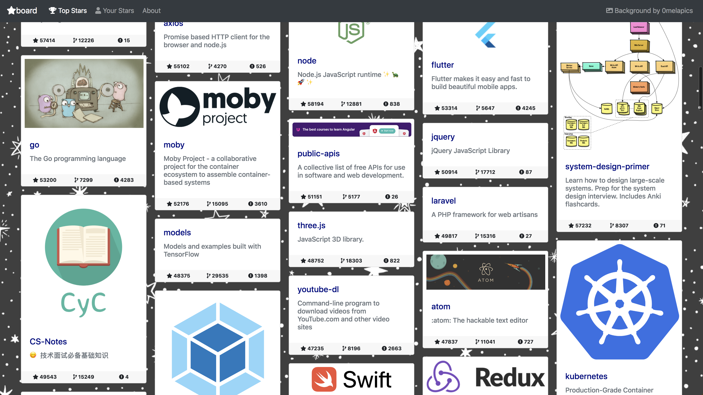

# [Starboard :star:](https://starboard.rachsharp.co.uk)

Take your GitHub Stars and make them shine. Presents the top GitHub stars as a
[masonry grid](https://masonry.desandro.com/). Authenticate via GitHub and it'll work with your own stars too!



[You can access the live site without any setup.](https://starboard.rachsharp.co.uk)

## Getting Started

These instructions will get you a copy of the project up and running on your local machine
for development and testing purposes. This was built from the [cookiecutter-django](https://cookiecutter-django.readthedocs.io/en/latest) template.
See the cookiecutter-django [deployment with docker](https://cookiecutter-django.readthedocs.io/en/latest/deployment-with-docker.html)
for instructions on how to deploy it into production.

### Prerequisites

- Python 3.6
- Postgres
- Redis
- Camo Server ([Camo is easiest to deploy on Heroku](https://github.com/atmos/camo))

### Installing

You can follow the instructions on the [cookiecutter django site](https://cookiecutter-django.readthedocs.io/en/latest/developing-locally.html)
to set up a local development environment, using this codebase rather than a fresh template. Populate a `.env` file using `.example-env` as a guide.

You will then need to run `python manage.py createsuperuser` in order to create an admin to perform Social App setup.
Then you can follow the [allauth post-install instructions](https://django-allauth.readthedocs.io/en/latest/installation.html#post-installation)
to activate GitHub authentication.

After signing in with a GitHub account, there's a task you can run to pre-populate top
repositories without having them be starred by a user.

```
python manage.py shell

from starboard.stars.tasks import get_top_repos
get_top_repos.delay(<your user pk, 2 if following this guide exactly>)
```

## Built With

* [Django](https://www.djangoproject.com/) - The web framework used
* [masonry.js](https://masonry.desandro.com/) - Used to render the grid of repos.
* [PyGithub](https://github.com/PyGithub/PyGithub) - Used to access the GitHub API
* [camo](https://github.com/atmos/camo) - Image Proxy to safely hotlink images from GitHub READMEs


## Authors

* [Rach Sharp](https://github.com/rach-sharp)

See also the list of [contributors](https://github.com/rach-sharp/starboard/contributors) who participated in this project.

## License

This project is licensed under the GPLv3 License - see the [LICENSE](LICENSE) file for details
